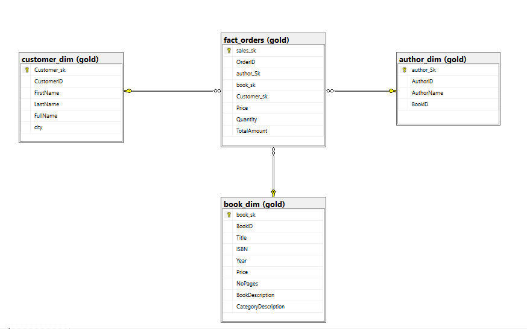

# Gravity BookStore Data Warehouse

An end-to-end data warehouse for a bookstore, built with **Python (pandas, SQLAlchemy)** and **SQL Server** using the **Medallion Architecture** (Bronze → Silver → Gold) and a **star schema** for analytics.

## Overview

The source data is 7 CSV files describing books, authors, categories, customers and orders. The pipeline loads them into SQL Server, cleans and type-casts them, then models them into a star schema ready for reporting (sales per book, author, customer, etc.).

## Architecture

| Layer | Purpose |
|-------|---------|
| **Bronze** | Raw data loaded as-is from the CSV files (all columns stored as `varchar`) |
| **Silver** | Cleaned data: proper data types, null handling, derived columns |
| **Gold** | Star schema (dimensions + fact table) with surrogate keys |

```
CSV files ──► Bronze (raw) ──► Silver (clean) ──► Gold (star schema)
```

## Star Schema



| Table | Type | Description |
|-------|------|-------------|
| `gold.fact_orders` | Fact | Order lines with price, quantity and `TotalAmount` |
| `gold.customer_dim` | Dimension | Customer name and city |
| `gold.book_dim` | Dimension | Book details joined with its category |
| `gold.author_dim` | Dimension | Authors linked to their books |

## Data Source

Seven CSV files, loaded from a local `Dataset/` folder:

`Author`, `Author_Book`, `Book`, `Book_Order`, `Category`, `Customer`, `Ordering`

## Transformations

**Silver layer**
- Cast IDs, year, pages and quantity to numeric types, and order dates to `date`
- Fill missing customer names and cities with `Unknown`, and missing `CustomerID` with `0`
- Fill missing order `Quantity` with `1`
- Create `FullName` (first name + last name) for customers
- Take the order line price from the book table

**Gold layer**
- `customer_dim`: selected customer columns
- `book_dim`: books joined with categories
- `author_dim`: authors joined with the author-book bridge table
- `fact_orders`: orders joined with order lines, `TotalAmount = Quantity × Price`, then mapped to the dimensions' surrogate keys

## Tech Stack

- Python 3, pandas
- SQLAlchemy + PyODBC
- SQL Server (T-SQL)
- Jupyter Notebook

## Project Structure

```
BookStore-DWH/
├── README.md
├── sql/
│   └── BookStore_dwh.sql      # database, schemas and table definitions
├── notebooks/
│   └── BookStore.ipynb        # ingestion + Bronze/Silver/Gold ETL
├── docs/
│   └── star_schema_BookStore_dwh.png
└── Dataset/                   # the 7 CSV files
```

## How to Run

1. **Install requirements**
   ```bash
   pip install pandas sqlalchemy pyodbc
   ```
   You also need the *ODBC Driver 17 for SQL Server* installed.

2. **Create the database and tables**
   Run `sql/BookStore_dwh.sql` in SQL Server Management Studio.

3. **Update the connection string** in the notebook with your own server name:
   ```python
   engine = create_engine(
       "mssql+pyodbc://<YOUR_SERVER>/Book_dwh"
       "?trusted_connection=yes"
       "&driver=ODBC+Driver+17+for+SQL+Server"
       "&TrustServerCertificate=yes"
   )
   ```

4. **Place the CSV files** in a `Dataset/` folder next to the notebook (or adjust the paths).

5. **Run the notebook** top to bottom: Ingestion → Bronze → Silver → Gold.

## Example Analysis Ideas

- Total revenue per book, category and author
- Top customers by total spending
- Orders and revenue per city
- Best-selling books by quantity

## Author

Your Name · [GitHub](https://github.com/your-username) · [LinkedIn](https://www.linkedin.com/in/your-profile)
